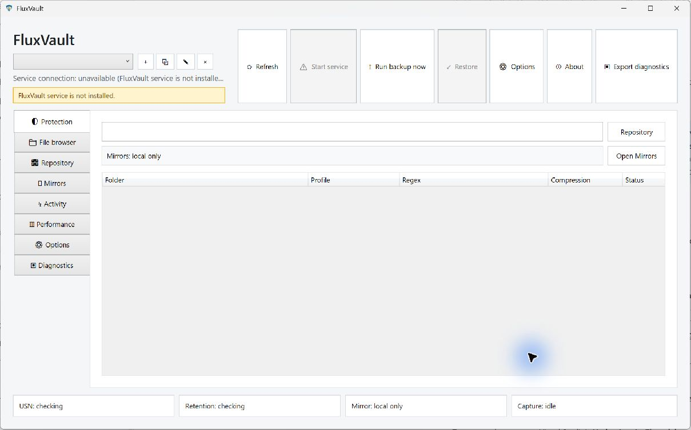
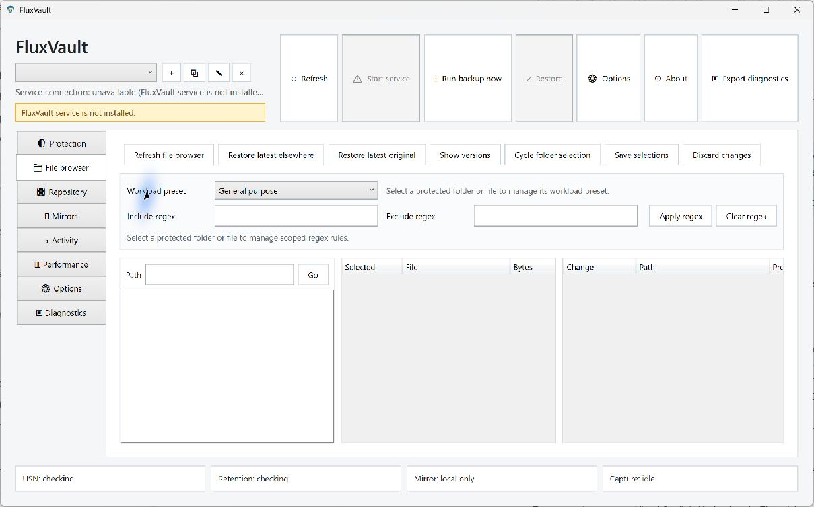
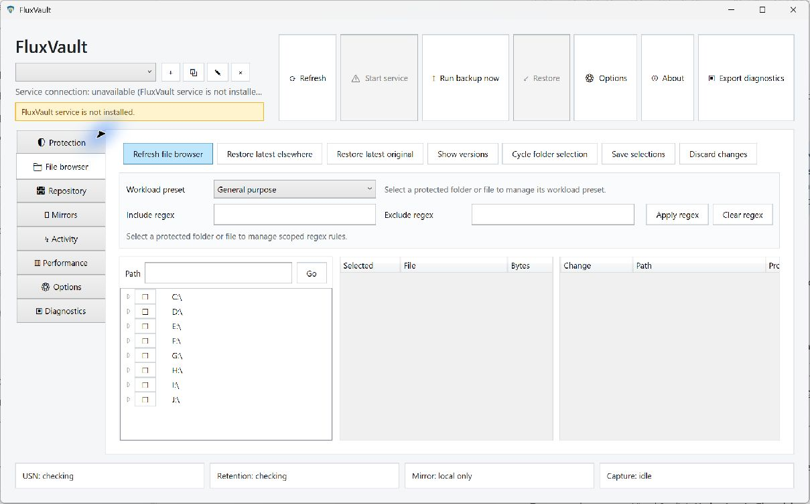
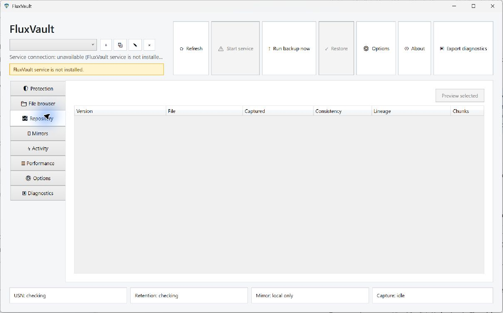
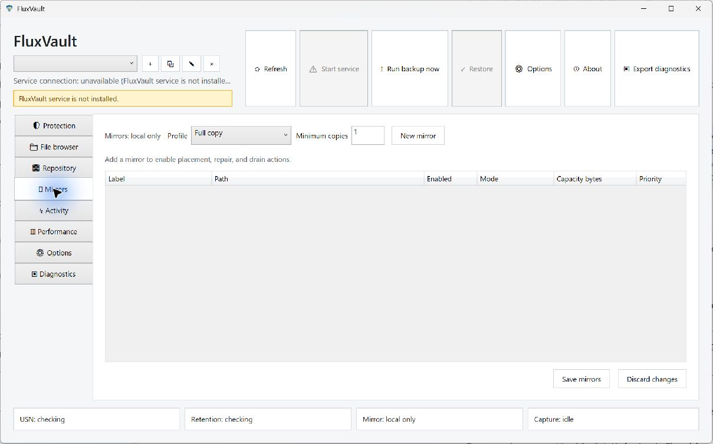
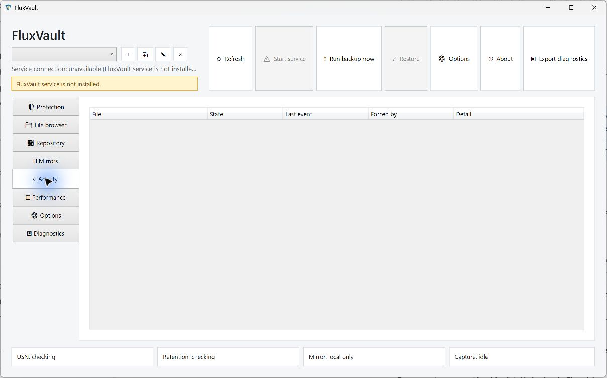
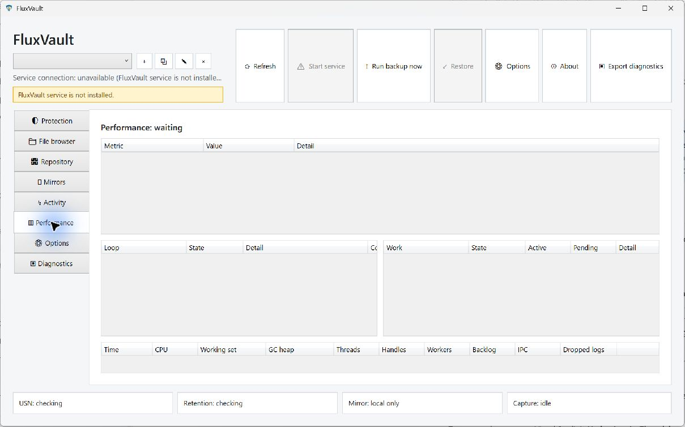
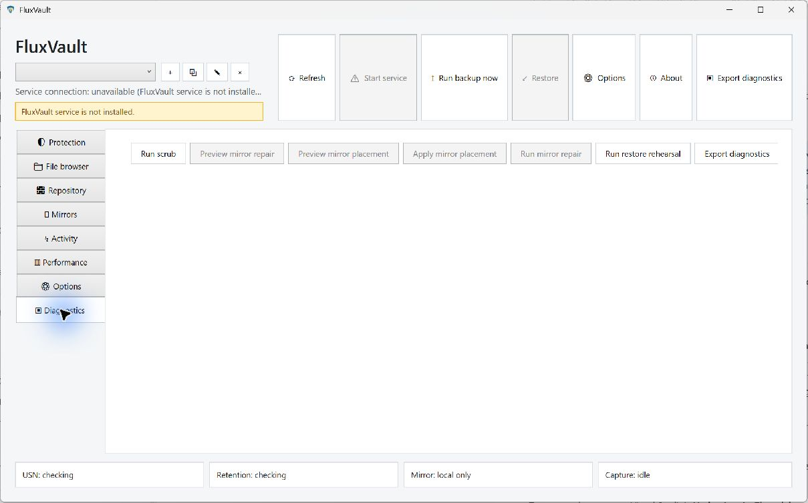
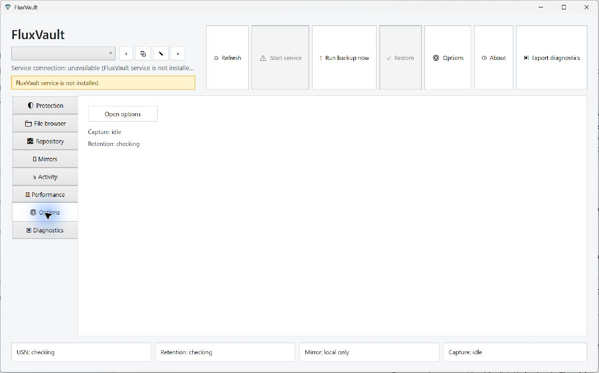

# FluxVault UX and interface review

The current interface exposes many implementation controls but gives a professional little help deciding whether work is safe or how to recover it. The recommended redesign is organised around protection, recovery and actionable health, with advanced internals available on demand. The [roadmap](../../improvement-roadmap.md) defines the proposed screens and acceptance criteria.

These are current captures of the Release build at b930ed5 on 1 October 2026, at the default window size. The service was not installed in this review environment. The screenshots therefore establish fresh/degraded-state behaviour and layout; they do not establish populated-vault usability, successful restoration, accessibility compliance or large-data responsiveness. No protection rules, repository settings, service registrations or real data were changed.

The same captured images were saved for this report. The UI Automation tree supplied control names/roles and corroborated state. It is not equivalent to a Narrator test. The Options crash prevented a stable live audit of the settings dialog; its controls were reviewed from source and view-model probes instead.

## 1. Open the dashboard

**Health: needs substantial redesign; service warning is useful.** The warning honestly says the service is not installed and disables Start service. However, Run backup now and Options remain active, the empty profile selector is unexplained, and the footer continues to say “checking” and “Capture: idle”. Those states do not tell the user how to establish protection. The prominent row of equally weighted, very tall buttons consumes space without establishing a primary task. The repository field has no visible descriptive label.

Replace the blank-table landing state with a guided setup/reconnect state. After setup, show protected work, last protected save, recoverability/verification age and only the next relevant actions. Service controls and diagnostics belong behind contextual help. Keep the existing honest unavailable warning.

## 2. Enter File browser before refreshing

**Health: confusing empty state.** The tree is blank without an explanation or loading/recovery action within the pane. Seven task buttons, workload presets and two regex fields appear before the user has chosen anything. This makes a basic “protect this project” task require understanding the app's internal selection model.

Populate available local roots independently of service connectivity, explain unavailable configuration separately, and show the selection action first. Advanced filtering should be progressive, with a preview of effective coverage.

## 3. Refresh File browser

**Health: functional local discovery, excessive interaction complexity.** Manual refresh populates drive roots. Equal-width panes leave the pending-changes pane permanently consuming a third of the space, even when empty. Its columns are clipped in the default view. The labelled “Cycle folder selection” action and compact glyph controls require users to learn a multi-state sequence; regex and raw byte counts dominate everyday selection.

Use explicit scope choices, readable sizes, contextual selection help, a searchable project/path picker and a review drawer that appears only when changes exist. Offer an advanced regex editor with match examples. Preserve the valuable existing save/discard boundary and retained manual child selections.

## 4. Open Repository

**Health: insufficient recovery guidance.** The primary recovery surface is an empty technical table with Version, Consistency, Lineage and Chunks columns. There is no visible search, time filter, explanation of why history is absent or next step. Restore lives in the global toolbar and relies on selection; this obscures the recovery journey.

Rename the user-facing destination to Recovery. Start with file/project search and a dated timeline. Show consistency in understandable language with detail available; move hashes/chunks/lineage internals into inspection. Present destination and collision planning, progress and verified outcome as one flow. The existing alternate-path and overwrite-confirmation mechanisms are worth preserving and strengthening.

## 5. Open Mirrors

**Health: some useful guidance, technical storage model.** “Add a mirror…” is a constructive empty-state hint, and unavailable maintenance actions are hidden. But placement Profile, Minimum copies, Capacity bytes, Priority and many detailed status columns expose configuration machinery before explaining what failure each copy protects against.

Use Storage with primary vault and recovery-copy cards/rows showing location, free/used capacity, last verified copy and independent recovery coverage. Put placement tuning in an advanced area. Removal must preview the effect on verified healthy copies and show a safe drain plan. A synced folder is not proof that its cloud provider has uploaded the files.

## 6. Open Activity

**Health: weak operational visibility.** The grid has no explanation of whether nothing happened, no data can be loaded, or the service is disconnected. “Forced by” and raw state fields describe engine mechanics rather than user impact. There is no visible guided retry or acknowledgement workflow in this empty state.

Show jobs and actionable events, with separate loading/empty/disconnected/error states. Each failure should answer which work is affected, whether its previous versions remain recoverable and what action resolves it. Group repetitive events, retain important failure history and make cancellation semantics explicit.

## 7. Open Performance

**Health: useful engineering surface, poor everyday interpretation.** Four technical grids occupy the screen; the only status is “Performance: waiting”. CPU/GC/thread/handle data can be valuable for diagnostics, but does not answer whether FluxVault is delaying the user's work or meeting capture targets.

Keep detailed counters under an expandable diagnostics view. Surface save-to-protected delay, backlog age, throughput, CPU/disk budget, storage growth and foreground interference in context. Replace indefinite waiting with a service-unavailable state. Report measured values and their freshness; do not use an unexplained synthetic health score.

## 8. Open Diagnostics

**Health: confirmed layout failure at the default window size.** The native screenshot repeatedly shows the action row while the health/details body is not visible. The UI Automation tree still contains repository, device, sync, cloud, security and fleet text. The XAML puts an unbounded toolbar in an Auto-width column beside a star-width text column (`MainWindow.xaml:844–918`), allowing controls to crowd the details out of useful layout. A second settled capture confirmed this was not merely a navigation frame.

Use a responsive/overflow command bar separate from content. Keep health summaries readable at the minimum supported size. Hide dormant capability readiness behind an advanced feature page; distinguish unsupported, disabled, unavailable and not-yet-implemented. Make checking integrity and repairing it separately understandable actions.

## 9. Enter Options from navigation

**Health: unnecessary extra navigation.** A full navigation destination contains an Open options button and two short status lines, despite Options also appearing in the main toolbar and tray. The extra page offers little value and divides settings across surfaces.

Make Settings an integrated destination with search and categories. Separate ordinary choices from operational/database details. Explain units and consequences next to controls; use inline validation rather than silently clamping values. Every visible setting must have a genuine runtime effect.

## 10. Open the Options dialog

**Health: blocked by a reproduced crash.** Opening Options with the service absent terminates FluxVault. The .NET Runtime event records TimeoutException from `NamedPipeFluxVaultClient.SendAsync` through `OptionsViewModel.InitialiseAsync:220` and `OptionsWindow_Loaded:18`. The window disappears before a stable settings flow can be inspected. A disposable view-model probe independently shows the timeout escaping initialisation. See the [crash evidence](evidence/options-crash.txt).

The repair is a recoverable unavailable state with preserved local input and explicit retry/reconnect. It also needs a consistent command result/cancellation policy throughout the UI; a global exception catcher alone would hide failed operations. Source inspection additionally found plain numeric edits, many low-level operational settings and database backup/worker fields with misleading runtime semantics. These need task-based redesign and runtime checks, not only reskinning.

## Accessibility and visual design

Confirmed observations are limited to screenshots/source/UI Automation: composite toolbar buttons are exposed without a useful control name in the tree, while some icon-only profile controls expose glyphs with tooltip descriptions; several text inputs lack a visible descriptive label; fixed dimensions/hard-coded colours and dense horizontal toolbars create reflow risks. Default-size Diagnostics already fails visibly. Native controls provide a useful semantic starting point, but there is no demonstrated full keyboard/screen-reader/high-contrast result in this review.

The new design should centralise typography, spacing, status colours, icons, density and focus states; support Windows theme/high contrast; provide explicit accessible names and keyboard access; and test long text, high DPI, small windows, multiple monitors and asynchronous state changes. These goals follow [Microsoft's Windows accessibility guidance](https://learn.microsoft.com/en-us/windows/apps/design/accessibility/accessibility-overview). Contrast ratios and WCAG conformance were not measured or certified here.

Visual modernisation should simplify hierarchy rather than add decorative cards everywhere. Use one clear primary task per context, concise everyday language, useful empty states, a consistent native icon vocabulary and progressively disclosed details. Do not conceal bad health with reassuring visual styling. The useful differentiation is visible proof that work can be recovered, backed by correct engine behaviour.

## Remaining workflow checks

The next rendered audit needs a disposable populated service/database and representative files. Cover first-run installation/setup, scope changes and history preservation, real capture progress, searching old/deleted/renamed work, version preview, restore planning/cancellation/overwrite failure, offline/slow/full storage, safe mirror removal, settings persistence, vault switching and tray notifications. Test keyboard/Narrator and scaling on those same flows. The absence of that evidence is a named follow-up gate in NEXT-007/008/011, not an assumption that the flows already work.
