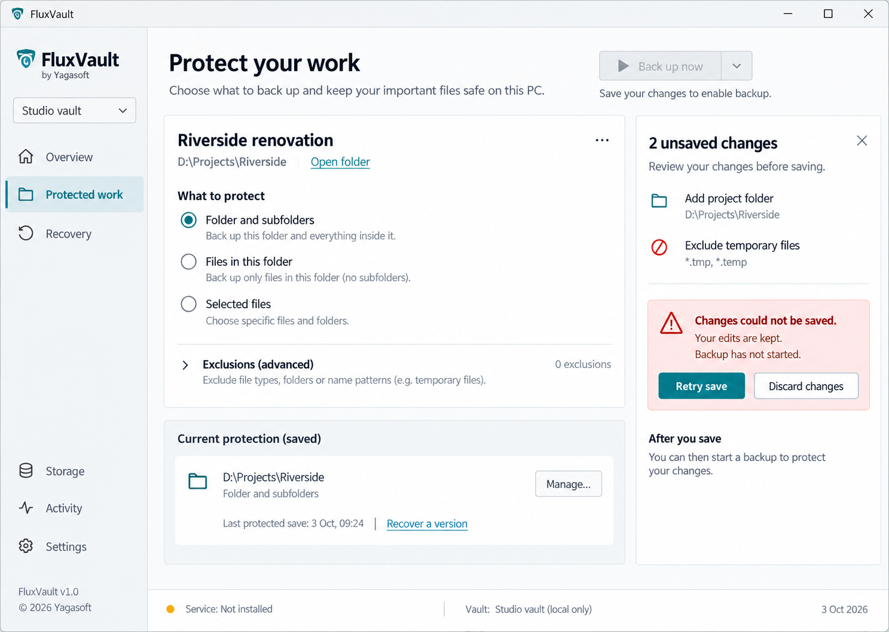
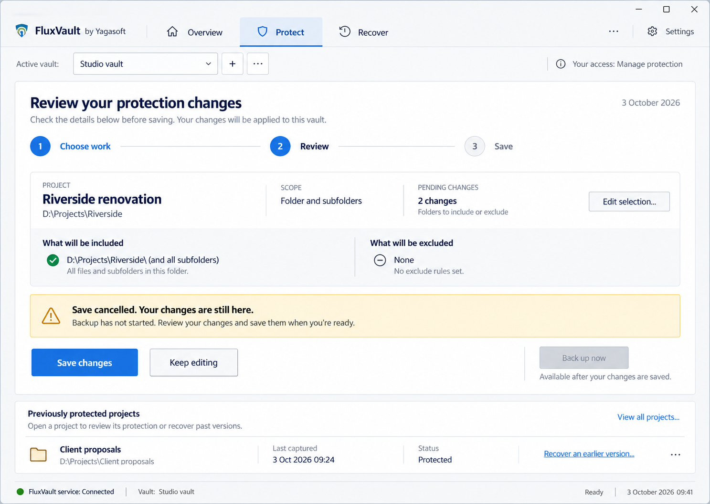
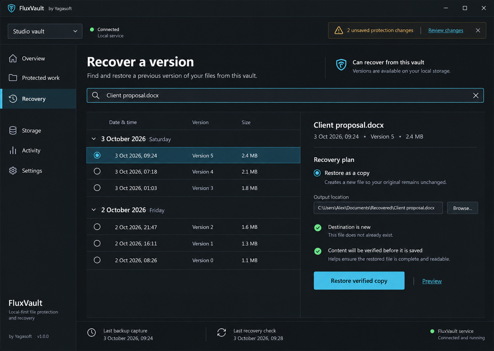

# Overview, protection and recovery exploration

Scope revision, 4 October 2026: exactly one logical vault per Windows installation. These completed concepts are preserved as historical evidence; vault selectors, discovery, creation and duplication are superseded. Further multi-vault concept exploration is stopped. The retained single-vault journey must use the actual binding/revision/save/backup/recovery state contracts; creator ownership and explicit access grants remain.

3 October 2026. Design exploration for the existing roadmap, grounded in the [actual 1 October screenshots and UX review](../../reviews/2026-10-01/ux-review.md). Windows/WPF, FluxVault/Yagasoft identity, local-first operation and multiple independent vaults stay fixed. Mock project names, dates and paths are illustrative, not user files or measured runtime evidence. These images are not an implemented UI.

The [NEXT-002/C specification](../../superpowers/specs/2026-10-03-next002-and-protection-save-design.md) defines the command and state contract. All directions must satisfy it; visual selection cannot relax authorisation, vault isolation or verified recovery.

The accepted access default is private to the creating Windows user, with explicit grants for other users or groups. The service supplies permitted vault summaries and capabilities; another ordinary user sees no vault names, counts or history without a grant. Grant management keeps the specification's elevated-administrator requirement. This policy is settled; no visual direction has yet been selected. Implementation is paused for the user's model switch.

## Three directions and the same three tasks

| Direction | Overview: understand protection | Protect: change coverage safely | Recover: retrieve an earlier version | Trade-off |
| --- | --- | --- | --- | --- |
| Compact professional workspace | Dense but readable project rows; latest captured save, last verified recovery and next issue; active vault always visible | Explicit scope choices beside a contextual pending-changes drawer; save failure stays next to retained edits | Project row opens a version list and destination plan in the same workspace | Fast for repeat users; density needs careful keyboard/DPI testing |
| Guided task workspace | Clear next action and a small list of previously protected projects | Choose → Review → Save; cancellation returns to the retained review; backup is a distinct next action | Choose file/version → Review destination → Restore → verified result | Clearer first use; more steps for frequent changes |
| Timeline-led recovery workspace | Recent protected saves and recovery evidence grouped by project, with a clear Protect action | Compact review of selection changes; draft banner remains distinct from recorded history | Search, chronological versions, destination/permission/conflict plan and verified result | Strong recovery focus; protection entry needs to remain easy to find |

### Compact professional workspace

### Guided task workspace

### Timeline-led recovery workspace

## Shared command and state contract

| Visible state/action | Required contract | UI behaviour |
| --- | --- | --- |
| Vault selector | Opaque VaultId + permitted summary, never just a display name/global active profile | Show only authorised vaults. Keep each draft/version selection keyed to its vault. Explain unavailable/denied separately from empty. |
| Overview: last protected save | A committed captured version, timestamp, consistency and freshness | A saved selection is not a backup. A capture timestamp is not a verified recovery timestamp. Unknown/stale/disconnected states must remain explicit. |
| New/edited protection selection | Local draft based on accepted configuration; no mutation yet | Preview effective coverage, explicit scope choices, advanced exclusions on demand. Keep pending changes visible until acknowledged or deliberately discarded. |
| Save changes | Captured target + edit generation; later VaultId + expected revision + OperationId | Display Saving; block conflicting target changes; no success or backup until acknowledged. Preserve all untouched settings. |
| Failed/cancelled save | Failed/Cancelled, retained draft, actionable reason | Explain “Your changes are kept. Backup has not started.” Scope that statement to the requested action. Retry/discard stay available as permitted. |
| Unknown save acknowledgement | Unknown; service outcome may need reconciliation | Say saving could not be confirmed, retain edits, stop dependent backup. Reconnect/status reconciliation precedes blind retry. Do not say the server rolled back. |
| Back up now | Confirmed saved target/revision and permission to capture | Enable for the accepted configuration. An explicit combined Save-and-back-up flow may run only after Saved. Permission failure produces a clear result and no capture command. |
| Read-only or denied access | Explicit capabilities from the service, checked again server-side | Explain why an action is unavailable; never imply that hidden buttons enforce security. Do not expose another vault's names, paths or counts. |
| Recovery search/selection | Authorised VaultId and version identity; paged inventory | Pending protection edits do not block permitted recovery of existing versions. Empty, unavailable and unauthorised are different states. |
| Recovery plan | Caller-authorised destination, collision decision and supported consistency/coverage | Default to a copy elsewhere. Preview is read-only; preflight is checked again through final publication. No green completion/verification badge before actual success. |
| Recovery in progress/result | Operation identity, progress/cancellation outcome, verified bytes/files and warnings | Show verified success only after publication. Preserve destination on pre-publication failure. Show later lineage warnings separately; no false rollback claim. |
| Background refresh | Status updates cannot overwrite local draft or persistent save failure | Connectivity and command results are separate. Preserve focus/selection for the same authorised vault; clear inaccessible data on access/identity change. |

The bounded C implementation initially repairs the current WPF flow. These images explore the later roadmap composition; they do not add a wizard, navigation system or recovery-plan implementation to C.

## Image review and corrections before implementation

The generated concepts were inspected as illustrations. Their text and symbols are not authoritative state evidence:

- Compact image repeats Riverside as both a newly added project and saved protection. Use a different already-protected project in that supporting row. Its “Service: Not installed” footer represents an unavailable draft-edit state; Retry save must be disabled or point to reconnection/setup until the service is available. Replace the ambiguous close icon on the draft drawer with collapse that retains edits, never implicit discard. The exclusions summary must distinguish saved and pending exclusions.
- Guided image says two changes while only one inclusion is fully enumerated. Render the actual two-item draft diff. A green inclusion symbol means selected coverage, not a completed backup; use neutral selection styling to avoid ambiguity. Simplify nested bordered panels during WPF composition.
- Timeline image uses a green check beside a future verification promise. Replace it with neutral pending text; reserve verified status for a completed result. Last recovery-check time must be labelled with its checked scope and kept separate from the selected version's status. The draft banner close action must retain edits.

All three concepts need the same explicit error, cancellation, permission-denied, unknown-acknowledgement, empty, offline, busy and success variants before implementation review. Full keyboard/Narrator/DPI/high-contrast/multi-monitor/performance validation remains the unchanged UI acceptance gate. No concept has passed it yet.

## Design decision

No direction is selected by this planning work. Choose or combine a direction after reviewing the three images and the task mapping. Refine the selected visual target before implementing the broader UI. Engineering of C and approved security boundaries can proceed independently of that visual choice.
